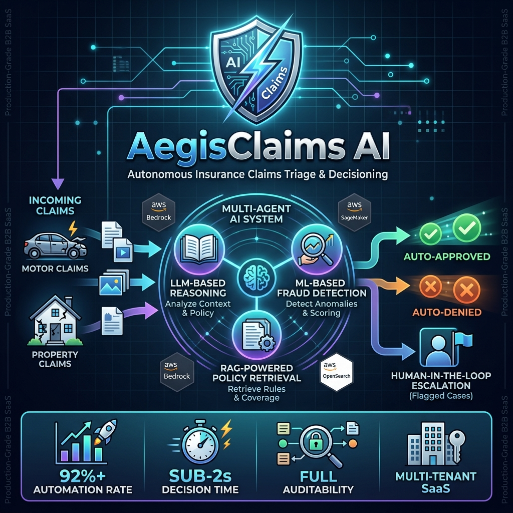

# AegisClaims AI

[](https://python.org)
[](https://reactjs.org)
[](https://aws.amazon.com)
[](https://aws.amazon.com/cdk/)



AegisClaims AI is an **experimental insurance-claims reference architecture** with FastAPI domain/application layers, a React interface, AWS service adapters and CDK infrastructure definitions. It explores claims triage and human review; it is not a verified operational SaaS deployment.

## 🎯 Overview

The repository contains claims-processing use cases, five specialist agent classes, Bedrock/SageMaker/OpenSearch adapters, and confidence-based human-review logic. These building blocks are only partially integrated: API dependencies are not configured by the current startup routine, the use case does not orchestrate the five agent classes, and coverage retrieval uses a placeholder embedding.

### Implementation Status
- Frontend authentication simulates a user and stores a tenant selection; Cognito token validation and backend role enforcement are not connected.
- Tenant IDs are represented in the domain, repository interfaces and API headers. Complete tenant isolation is not established by this prototype.
- Dashboard and API fallback metrics are illustrative data, not measurements from an operating claims service.
- AWS adapters and CDK definitions require configuration, integration and validation. Their presence does not demonstrate a deployed service or GDPR compliance.
- The dashboard image above illustrates the intended UI; its numbers are not benchmark or customer results.

### Design Goals
- Explore claim triage with confidence thresholds and human review.
- Record decision reasoning and tenant context.
- Evaluate a layered architecture for future service integration.

The displayed 92.4% automation rate and 1.8-second latency are demo values. No customer automation, latency or business-impact results are established.

---

## ✨ Key Features

### 🤖 Specialist Agent Building Blocks
| Agent | Purpose | Technology |
|-------|---------|------------|
| **Claim Intake Agent** | Validates and normalizes claim data | Python |
| **Document Understanding Agent** | OCR + NLP for unstructured documents | AWS Bedrock |
| **Fraud Detection Agent** | ML-based anomaly detection | AWS SageMaker |
| **Coverage Reasoning Agent** | LLM + RAG for policy analysis | AWS Bedrock + OpenSearch |
| **Decision Agent** | Confidence-based decisioning with HITL | Python |

### 🏢 Tenant-Aware Design
- `tenant_id` fields and tenant-scoped repository interfaces
- Configuration and prompt-versioning design artifacts
- API tenant context currently comes from a caller-supplied header; secure tenant assignment and isolation require further integration

### 🔐 Security Design and Limitations
- Cognito infrastructure definitions and role concepts are included.
- Frontend authentication is simulated; the backend does not currently enforce Cognito authentication or those roles.
- Audit middleware logs request metadata; it does not establish complete decision auditability.
- Data-protection and security controls require implementation and assessment before real insurance data is used. GDPR compliance is not verified.

### 📊 AI Ops Dashboard Prototype
- Illustrative automation, drift, precision and latency displays
- Static example claims and mock analytics fallback responses
- Monitoring interfaces and adapters for future integration; no verified live monitoring pipeline

---

## 🏗️ Intended Architecture

```
┌─────────────────────────────────────────────────────────────────┐
│                        React Frontend                           │
│  (Dashboard, Claim Details, AI Ops, Login/Tenant Selection)    │
└─────────────────────────────────────────────────────────────────┘
                                │
                                ▼
┌─────────────────────────────────────────────────────────────────┐
│                     FastAPI Interface Layer                     │
│           (REST APIs, DTOs, Audit Middleware)                  │
└─────────────────────────────────────────────────────────────────┘
                                │
                                ▼
┌─────────────────────────────────────────────────────────────────┐
│                    Application Layer                            │
│    (Use Cases, Agent Orchestration, Tenant Context)            │
└─────────────────────────────────────────────────────────────────┘
                                │
          ┌─────────────────────┼─────────────────────┐
          ▼                     ▼                     ▼
┌─────────────────┐  ┌─────────────────┐  ┌─────────────────┐
│  Domain Layer   │  │ Infrastructure  │  │   AI Services   │
│   (Entities,    │  │  (PostgreSQL,   │  │  (Bedrock LLM,  │
│  Value Objects) │  │ DynamoDB, S3)   │  │ SageMaker ML)   │
└─────────────────┘  └─────────────────┘  └─────────────────┘
```

### Clean Architecture Layers
- **Domain**: Pure business logic (no frameworks, no AWS SDKs)
- **Application**: Use cases, agents, ports/interfaces
- **Infrastructure**: AWS implementations, repositories
- **Interface**: REST APIs, DTOs, middleware

---

## 🛠️ Technology Stack

### Backend
| Component | Technology |
|-----------|------------|
| Runtime | Python 3.11+ |
| Framework | FastAPI |
| ORM | SQLAlchemy (async) |
| Validation | Pydantic |

### Frontend
| Component | Technology |
|-----------|------------|
| Framework | React 18 |
| Language | TypeScript |
| Build Tool | Vite |
| Routing | React Router 6 |

### AWS Service Adapters and Infrastructure Definitions

This inventory describes integration targets, not a verified deployment. Authentication and runtime dependency wiring remain incomplete.
| Service | Purpose |
|---------|---------|
| Bedrock | LLM for coverage reasoning |
| SageMaker | Fraud detection ML model |
| Cognito | Authentication & RBAC |
| S3 | Document storage |
| DynamoDB | Agent state & idempotency |
| OpenSearch | Vector embeddings for RAG |
| RDS PostgreSQL | Transactional data |
| Redshift | Analytics & reporting |

### Infrastructure
| Tool | Purpose |
|------|---------|
| AWS CDK (Python) | Infrastructure as Code |
| Docker | Containerization target (container files are not included in the current tree) |
| CloudWatch | Logging & monitoring |

---

## 📁 Project Structure

```
aegis-claims-ai-platform/
├── backend/
│   ├── domain/           # Entities, Value Objects, Domain Services
│   ├── application/      # Use Cases, Agents, Ports
│   ├── infrastructure/   # AWS adapters, Repositories
│   ├── interfaces/       # FastAPI routes, DTOs, Middleware
│   └── tests/            # Unit & integration tests
├── frontend/
│   ├── src/
│   │   ├── components/   # Reusable UI components
│   │   ├── pages/        # Page components
│   │   ├── services/     # API service layer
│   │   ├── context/      # React contexts (Auth)
│   │   └── auth/         # Protected routes
├── prompts/              # Versioned LLM prompt templates
├── evaluations/          # Model evaluation datasets
├── cdk/                  # AWS CDK infrastructure (Python)
├── docs/                 # Architecture documentation
└── README.md
```

---

## 🚀 Quick Start

### Prerequisites
- Python 3.11+
- Node.js 18+
- AWS Account with configured credentials
- PostgreSQL 15+

### Backend Setup
```bash
python -m venv venv
source venv/bin/activate  # Windows: venv\Scripts\activate
pip install -r backend/requirements.txt
uvicorn backend.main:app --reload
```

### Frontend Setup
```bash
cd frontend
npm install
npm run dev
```

Run the backend command from the repository root. Claims endpoints require dependency configuration that is not performed by the current startup routine.

See [INSTRUCTIONS.md](./docs/INSTRUCTIONS.md) for setup and configuration design notes.

---

## 📚 Documentation

| Document | Description |
|----------|-------------|
| [Setup Instructions](./docs/INSTRUCTIONS.md) | Complete setup and running guide |
| [API Reference](./docs/api.md) | REST API endpoints and examples |
| [Architecture Guide](./docs/architecture.md) | System design and Clean Architecture |
| [AI Agents Guide](./docs/agents.md) | Specialist agent design documentation |
| [Multi-Tenancy Guide](./docs/multi-tenancy.md) | Tenant isolation mechanisms |
| [Deployment Guide](./docs/deployment.md) | Proposed AWS deployment configuration |
| [Original Requirements](./docs/prompt.md) | Full project specification |

---

## 🧪 Testing

```bash
# Backend tests
cd backend
pytest tests/ -v

# Frontend tests
cd frontend
npm run test
```

---

## 📄 License

Proprietary - All Rights Reserved

---

## 🤝 Contributing

This public repository documents an experimental reference implementation. See the license before reuse or contribution.
