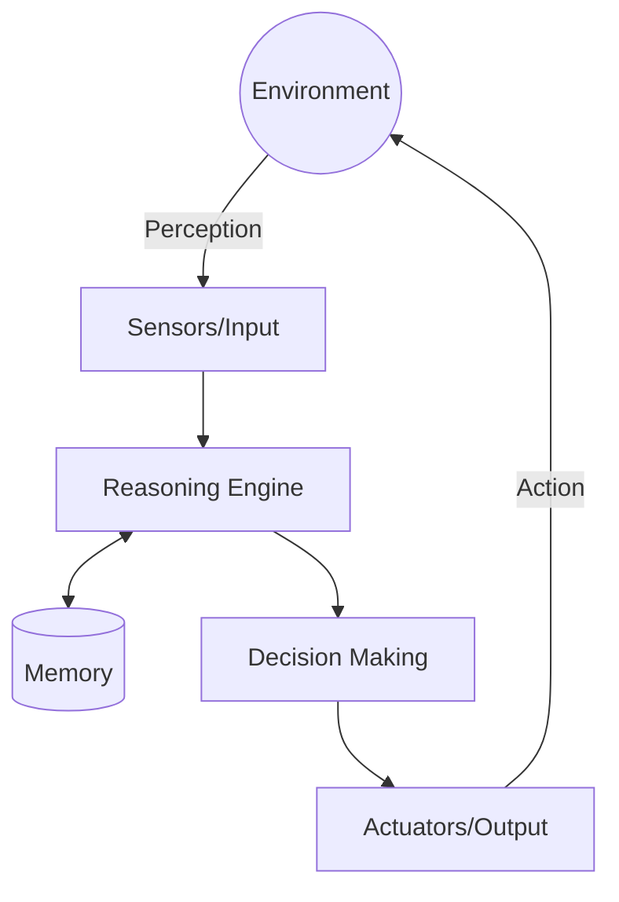

# AI Agents: From Fundamentals to Advanced Implementation

This guide provides a comprehensive overview of Artificial Intelligence (AI) Agents, covering foundational concepts, architectural components, multi-agent coordination, and modern LLM-based implementations.

---

## 1. Fundamentals

### What are AI Agents?
An **AI Agent** is an autonomous or semi-autonomous system that perceives its environment, reasons about how to achieve specific goals, and takes actions to change that environment. Unlike traditional software that follows a fixed script, agents are **goal-oriented** and **adaptive**.

### Types of Agents
1.  **Simple Reflex Agents**: Act based only on the current perception (if-then rules). They have no memory of the past.
2.  **Model-Based Reflex Agents**: Maintain an internal state to track aspects of the environment they cannot see currently.
3.  **Goal-Based Agents**: Use goal information to describe desirable situations and choose actions that lead to them.
4.  **Utility-Based Agents**: Use a utility function to choose the "best" action among several that achieve the goal, optimizing for a specific metric (e.g., speed, cost).
5.  **Learning Agents**: Can operate in unknown environments and become more competent over time by learning from experiences.

### Agent Architectures
-   **Reactive**: Direct mapping from sensors to actuators (fast, but lacks foresight).
-   **Deliberative**: Uses symbol manipulation and logic to plan (slow, but capable of complex reasoning).
-   **Hybrid**: Combines reactive and deliberative layers (e.g., a robot that navigates obstacles reactively while planning a route deliberatively).

---

## 2. Agent Components



1.  **Perception**: Converting raw data (text, images, sensor logs) into internal representations.
2.  **Reasoning**: The "brain" that processes information. In modern agents, this is often a Large Language Model (LLM).
3.  **Decision-Making**: Selecting a sequence of actions (Planning).
4.  **Action Execution**: Interacting with the world via tools, APIs, or physical actuators.
5.  **Memory**:
    *   **Short-term**: Current context and conversation history.
    *   **Long-term**: Knowledge base, documents, and historical outcomes.
6.  **Learning**: Improving performance based on feedback or trial-and-error.

---

## 3. Multi-Agent Systems (MAS)

Multi-Agent Systems consist of multiple interacting agents that cooperate or compete to solve complex problems.

### Coordination & Collaboration Patterns
-   **Manager-Worker**: A "Lead Agent" decomposes a task and assigns sub-tasks to specialized workers.
-   **Peer-to-Peer**: Agents communicate directly to share information and reach a consensus.
-   **Blackboard Pattern**: Agents contribute information to a shared "blackboard" and act when they see data they can process.

### Orchestration
Orchestration involves managing the lifecycle and communication flow between agents. Frameworks like **CrewAI** or **Microsoft AutoGen** specialize in this.

---

## 4. Autonomous Agents

Autonomous agents require minimal human intervention. They are defined by:
-   **Goal-Oriented Behavior**: They don't just follow steps; they aim for an outcome.
-   **Planning Algorithms**:
    *   **STRIPS**: Classical logic-based planning.
    *   **Hierarchical Task Networks (HTN)**: Breaking complex goals into smaller tasks.
-   **Autonomy Levels**: Range from "Human-in-the-loop" (low autonomy) to "Fully Autonomous" (high autonomy).

---

## 5. LLM-Based Agents

Large Language Models (LLMs) have revolutionized agents by providing a powerful, general-purpose reasoning engine.

### How LLMs Enable Agentic Behavior
LLMs can understand intent, decompose problems, and predict the next logical step. By giving an LLM access to "Tools," it becomes an agent.

### Core Concepts
-   **Prompt Engineering**: Guiding the agent's persona and reasoning style (e.g., "You are a professional claims adjuster...").
-   **Tool Use (Function Calling)**: The LLM generates a structured call (e.g., JSON) to an external function, which the system executes and returns the result to the LLM.

### The ReAct Pattern
**ReAct** (Reason + Act) is a popular framework where the agent generates a *Thought*, an *Action*, and an *Observation* in a loop.

---

## 6. Agent Frameworks

| Framework | Focus | Key Strength |
| :--- | :--- | :--- |
| **LangChain** | Building LLM Apps | Massive ecosystem of tools and integrations. |
| **CrewAI** | Multi-Agent Orchestration | Role-playing and collaborative process driven. |
| **AutoGPT** | Full Autonomy | High-level goal pursuit with autonomous loops. |
| **BabyAGI** | Task Management | Simple, recursive task creation and prioritization. |
| **Microsoft AutoGen** | Multi-Agent Conversation | Highly customizable agent interactions. |

---

## 7. Real-World Applications: Insurance Focus

Agents are particularly transformative in the insurance sector:

1.  **Claims Triage Agent**: Automatically reviews incoming claims, validates documents, and assigns a risk score.
2.  **Fraud Detection Agent**: Cross-references claim data against historical patterns and external databases to flag anomalies.
3.  **Coverage Reasoning Agent**: Uses RAG (Retrieval-Augmented Generation) to compare a specific claim against complex policy wording.
4.  **Customer Support Agent**: Handles policy inquiries and basic claim status updates 24/7.

---

## 8. Advanced Topics

### Agent Memory Systems
-   **Short-term Memory**: The context window of the LLM.
-   **Long-term Memory (Vector DBs)**: Storing embeddings for fast retrieval of relevant history.
-   **Episodic Memory**: Remembering specific past experiences and their outcomes.

### Multi-Step Reasoning
-   **Chain-of-Thought (CoT)**: Forcing the model to explain its steps before giving an answer.
-   **Tree-of-Thoughts (ToT)**: Exploring multiple reasoning paths and choosing the best one.

### Retrieval-Augmented Generation (RAG)
Agents use RAG to access private, up-to-date information without retraining the model.

---

## 9. Implementation Pattern: Simple ReAct Agent

Here is a conceptual Python example using a pseudo-LLM client:

```python
class InsuranceAgent:
    def __init__(self, llm_client, tools):
        self.llm = llm_client
        self.tools = tools
        self.memory = []

    def run(self, goal):
        print(f"Goal: {goal}")
        while True:
            # 1. Reason (Thought)
            prompt = self._build_prompt(goal)
            response = self.llm.generate(prompt)
            
            thought, action, params = self._parse_response(response)
            print(f"Thought: {thought}")
            
            if action == "FINISH":
                return params # Final Answer
            
            # 2. Act (Tool Use)
            print(f"Action: {action}({params})")
            observation = self.tools[action](**params)
            
            # 3. Observe
            print(f"Observation: {observation}")
            self.memory.append({"action": action, "result": observation})

    def _build_prompt(self, goal):
        # Combines goal, memory, and tool descriptions
        return f"Help with: {goal}. History: {self.memory}"
```

---

## 10. Best Practices

### Safety and Ethics
-   **Guardrails**: Implement pre- and post-processing layers to ensure the agent doesn't hallucinate or leak data.
-   **Prompt Injection Protection**: Sanitize user inputs used in agent prompts.

### Production Deployment
-   **Human-in-the-loop (HITL)**: Require human approval for high-stakes actions (e.g., approving a payout).
-   **Monitoring**: Track "Agent Drift" and token consumption.
-   **Error Handling**: Implement retry logic for transient tool failures and fallback paths for stalled reasoning loops.

### Evaluation
-   **Benchmarking**: Test agents against sets of known correct steps (Trajectories).
-   **A/B Testing**: Compare different prompts or models for the same agent task.
