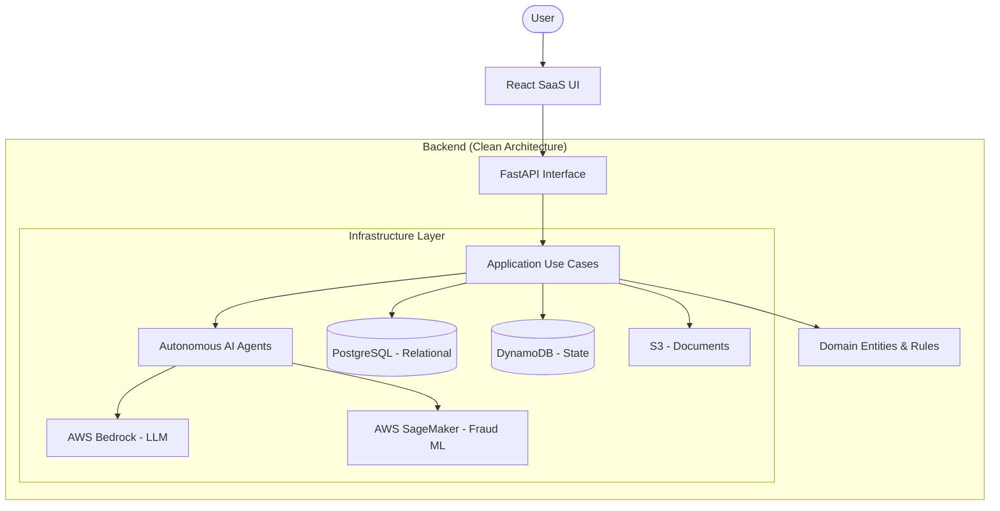

# AegisClaims AI Architecture

AegisClaims AI is built on **Clean Architecture** principles to ensure a decoupled, testable, and production-ready SaaS system.

## High-Level Architecture

## Multi-Tenancy Strategy
- **Data Isolation**: Each record in PostgreSQL and DynamoDB includes a `tenant_id`. Queries are strictly scoped using this ID.
- **Storage Isolation**: S3 objects are prefixed with `{tenant_id}/`.
- **Compute Isolation**: IAM policies enforce that specific execution roles can only access resources tagged with the corresponding `tenant_id` (using ABAC where applicable).

## AI Decision Flow
1. **Intake**: Claims are submitted via API and documents are uploaded to S3.
2. **Analysis**: Specialized agents (Document, Fraud, Coverage) process the claim in parallel.
3. **Reasoning**: An LLM-based agent (Bedrock) synthesizes all info to produce a coverage recommendation.
4. **Decision**: A confidence-based logic approves, denies, or escalates the claim to a human.
5. **Traceability**: Every step of the agent execution is logged in a reasoning trace for auditability.
