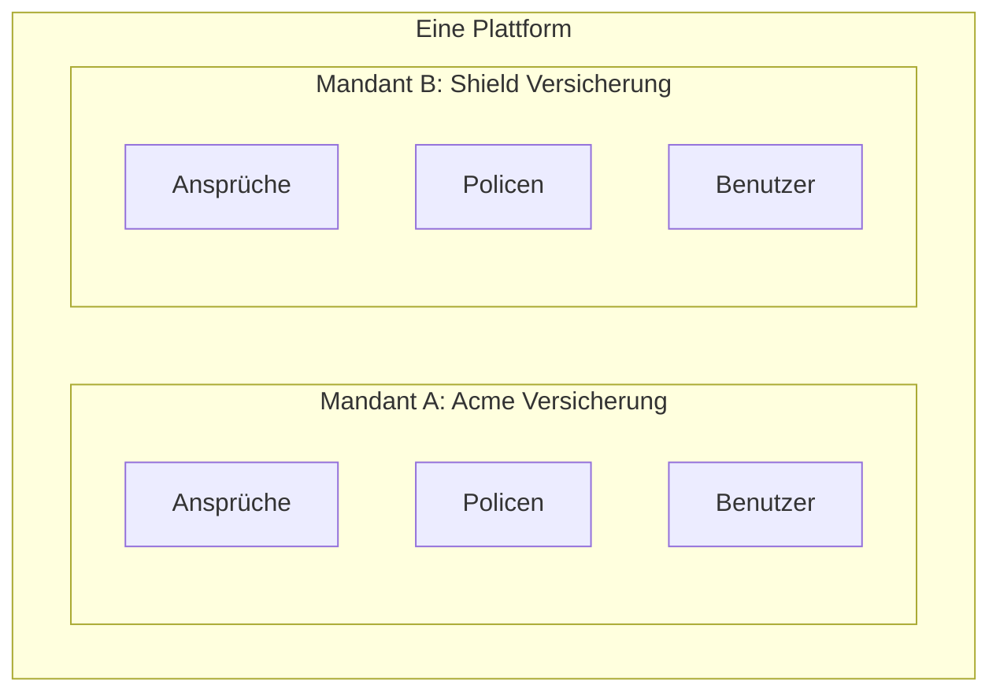
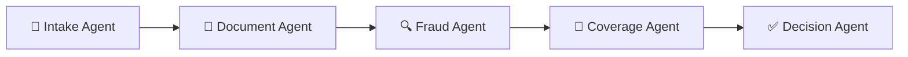

# AegisClaims AI - Leitfaden zur Interviewvorbereitung

Ein umfassender Leitfaden zum Verständnis und zur Diskussion der AegisClaims AI-Plattform, verfasst für alle, unabhängig von ihrem Hintergrund in Versicherungen oder Cloud-Technologien.

---

## Inhaltsverzeichnis

1. [Zusammenfassung](#1-zusammenfassung)
2. [Konzepte aus der Versicherungsbranche](#2-konzepte-aus-der-versicherungsbranche)
3. [Erläuterungen zum Technologie-Stack](#3-erläuterungen-zum-technologie-stack)
4. [Architekturübersicht](#4-architekturübersicht)
5. [Hauptfunktionen](#5-hauptfunktionen)
6. [Projektstruktur](#6-projektstruktur)
7. [Interview-Gesprächspunkte](#7-interview-gesprächspunkte)

---

## 1. Zusammenfassung

### Was ist AegisClaims AI?

**Einzeilige Antwort**: AegisClaims AI ist eine Softwareplattform, die künstliche Intelligenz nutzt, um Versicherungsansprüche automatisch zu bearbeiten und zu entscheiden, ob sie genehmigt, abgelehnt oder an einen menschlichen Prüfer eskaliert werden sollen.

### Das Problem, das wir lösen

Stellen Sie sich vor, Sie haben einen Autounfall. Sie reichen einen Schadenfall bei Ihrer Versicherung ein. Traditionell würde ein menschlicher Sachbearbeiter:
1. Ihre Schadenunterlagen prüfen
2. Ihre Police überprüfen, um zu sehen, was abgedeckt ist
3. Nach Anzeichen von Betrug suchen
4. Eine Entscheidung treffen (genehmigen, ablehnen oder weitere Informationen anfordern)

Dieser Prozess dauert typischerweise **Tage bis Wochen** und kostet Versicherungsunternehmen erhebliche Arbeitskosten.

### Unsere Lösung

AegisClaims AI automatisiert diesen gesamten Prozess in **unter 2 Sekunden**:
- KI liest und versteht Ihre Schadenunterlagen
- Machine Learning erkennt potenziellen Betrug
- Eine KI-Reasoning-Engine prüft die Deckung der Police
- Automatische Entscheidungen werden für eindeutige Fälle getroffen
- Unsichere Fälle werden an menschliche Prüfer weitergeleitet

### Warum es wichtig ist

| Metrik | Vorher | Nachher |
|--------|--------|---------|
| Bearbeitungszeit | 3-7 Tage | Unter 2 Sekunden |
| Automatisierungsrate | ~20% | 92%+ |
| Kosten pro Schadenfall | 50-100 € | ~5 € |
| Betrugserkennung | Reaktiv | Proaktiv |

### Wer nutzt es?

Dies ist ein **B2B (Business-to-Business) SaaS**-Produkt. Unsere Kunden sind Versicherungsunternehmen, nicht einzelne Verbraucher. Mehrere Versicherungsunternehmen können unsere Plattform gleichzeitig nutzen – jedes mit seinen eigenen isolierten Daten und individuellen Konfigurationen.

---

## 2. Konzepte aus der Versicherungsbranche

### Was ist ein Schadenfall (Claim)?

**Einfache Erklärung**: Ein Schadenfall ist ein formeller Antrag, den Sie bei Ihrer Versicherungsgesellschaft einreichen, um sie zu bitten, etwas zu bezahlen, das durch Ihre Police abgedeckt ist.

**Beispiel aus der Praxis**: 
> Sie haben eine Kfz-Versicherung. Ein Baum fällt während eines Sturms auf Ihr Auto. Sie reichen einen Schadenfall ein und sagen: "Ein Baum hat mein Auto beschädigt. Hier sind Fotos und der Kostenvoranschlag. Bitte bezahlen Sie die Reparatur."

**In unserem System**: Ein Schadenfall ist ein Datensatz, der enthält:
- Wer den Antrag stellt (Versicherungsnehmer)
- Was passiert ist (Vorfallbeschreibung)
- Wann es passiert ist (Datum des Vorfalls)
- Wie viel Geld angefordert wird (Schadensumme)
- Unterstützende Dokumente (Fotos, Rechnungen, Polizeiberichte)

---

### Was ist eine Police?

**Einfache Erklärung**: Eine Police ist der Vertrag zwischen Ihnen und der Versicherungsgesellschaft. Sie legt genau fest, wofür gezahlt wird und wofür nicht.

**Beispiel aus der Praxis**:
> Ihre Kfz-Versicherungspolice könnte sagen: "Wir decken Kollisionsschäden bis zu 50.000 € mit einer Selbstbeteiligung von 500 €. Hochwasserschäden sind nicht abgedeckt."

**Wichtige Policenkomponenten**:
| Begriff | Bedeutung |
|---------|-----------|
| **Deckung** | Welche Ereignisse/Schäden geschützt sind |
| **Limit** | Maximaler Betrag, der gezahlt wird |
| **Selbstbeteiligung** | Betrag, den Sie zuerst zahlen, bevor die Versicherung einspringt |
| **Ausschlüsse** | Dinge, die ausdrücklich NICHT abgedeckt sind |

---

### Was ist Schadenstriage?

**Einfache Erklärung**: Triage bedeutet das Sortieren und Priorisieren von Schadenfällen, um zu entscheiden, welche Maßnahme ergriffen werden soll.

**Analogie**: Denken Sie an eine Notaufnahme in einem Krankenhaus. Wenn Patienten ankommen, bewertet eine Pflegekraft jeden Patienten schnell, um zu entscheiden:
- Wer sofortige Aufmerksamkeit braucht (kritisch)
- Wer etwas warten kann (moderat)
- Wer später einen regulären Arzt sehen sollte (leicht)

**Bei Versicherungsansprüchen**:
- **Auto-Genehmigung**: Eindeutig gültige Ansprüche
- **Auto-Ablehnung**: Ansprüche für Dinge, die nicht abgedeckt sind
- **Eskalation**: Komplexe Fälle, die menschliche Prüfung erfordern

---

### Was ist eine Selbstbeteiligung?

**Einfache Erklärung**: Der Betrag, den Sie aus eigener Tasche zahlen, bevor die Versicherung irgendetwas zahlt.

**Beispiel**:
> Ihre Police hat eine Selbstbeteiligung von 500 €. Sie reichen einen Schadenfall über 2.000 € Schaden ein.
> - Sie zahlen: 500 €
> - Versicherung zahlt: 1.500 €

**Warum es existiert**: Selbstbeteiligungen verhindern, dass Menschen winzige Ansprüche einreichen, und halten die Prämien niedriger.

---

### Was sind Deckungsgrenzen?

**Einfache Erklärung**: Der maximale Betrag, den eine Versicherungsgesellschaft für einen abgedeckten Schadenfall zahlen wird.

**Beispiel**:
> Ihre Police hat ein Limit von 50.000 € für Kollisionsschäden. Ihr Auto im Wert von 80.000 € ist ein Totalschaden.
> - Versicherung zahlt: 50.000 € (das Limit)
> - Sie tragen: 30.000 € Verlust

---

### Was ist Betrugserkennung?

**Einfache Erklärung**: Das Identifizieren von gefälschten, übertriebenen oder verdächtigen Ansprüchen.

**Häufige Betrugsmuster**:
| Typ | Beispiel |
|-----|----------|
| Inszenierte Unfälle | Vortäuschen eines Autounfalls für Geld |
| Überhöhte Ansprüche | Geringer Schaden wird als großer Schaden deklariert |
| Zeitbetrug | Schaden entstand vor Policenbeginn |
| Phantomansprüche | Geltendmachung von Gegenständen, die nicht existieren |

**Wie wir es erkennen**: Unser Machine-Learning-Modell analysiert Muster wie:
- Schadensumme vs. Policenhistorie
- Zeit seit Policenabschluss
- Dokumentenkonsistenz
- Historische Anspruchshäufigkeit

---

### Was ist Schadensautomatisierung?

**Einfache Erklärung**: Das Verwenden von Software und KI zur Bearbeitung von Ansprüchen ohne menschliche Beteiligung.

**Das Spektrum**:
```
VOLLSTÄNDIG MANUELL ◄──────────────────────────────────► VOLLSTÄNDIG AUTOMATISIERT
        │                                                           │
   Traditionell                                               AegisClaims AI
   (Mensch prüft                                             (KI bearbeitet 92%
    jeden Anspruch)                                           automatisch)
```

**Human-in-the-Loop (HITL)**: Auch bei Automatisierung erfordern einige Ansprüche menschliches Urteilsvermögen. Unser System identifiziert diese automatisch und leitet sie an menschliche Prüfer weiter.

---

## 3. Erläuterungen zum Technologie-Stack

### AWS Bedrock (KI/LLM-Dienst)

**Was es in einfachen Worten ist**: 
Ein Dienst von Amazon, der es uns ermöglicht, leistungsstarke KI-Sprachmodelle (wie ChatGPT, aber von Anthropic namens Claude) zu nutzen, ohne unsere eigene KI von Grund auf zu entwickeln.

**Analogie**: Anstatt Ihren eigenen Automotor herzustellen, kaufen Sie einen von einem spezialisierten Unternehmen, das erstklassige Motoren herstellt.

**Warum wir es gewählt haben**:
- Zugang zu modernsten KI-Modellen (Claude 3)
- Keine Notwendigkeit, eigene Modelle zu trainieren oder zu hosten
- Enterprise-Grade-Sicherheit und Zuverlässigkeit
- Zahlen nur für das, was wir nutzen

**Wie wir es nutzen**:
- **Coverage Reasoning Agent**: Sendet Policendetails und Schadensinformationen an Claude, fragt "Ist dieser Anspruch abgedeckt? Erklären Sie Ihre Begründung."
- **Document Understanding**: Claude kann PDFs und Bilder lesen, um Informationen zu extrahieren

---

### AWS SageMaker (Machine Learning)

**Was es in einfachen Worten ist**:
Eine Plattform zum Erstellen, Trainieren und Ausführen benutzerdefinierter Machine-Learning-Modelle.

**Analogie**: Wenn Bedrock der Kauf eines fertigen Motors ist, ist SageMaker eine Fabrik, in der Sie Ihren eigenen spezialisierten Motor bauen.

**Warum wir es gewählt haben**:
- Wir brauchten ein benutzerdefiniertes Betrugserkennungsmodell, das auf Versicherungsdaten trainiert wurde
- Handhabt Modelltraining, Versionierung und Deployment
- Skaliert automatisch basierend auf der Nachfrage

**Wie wir es nutzen**:
- **Fraud Detection Agent**: Unser benutzerdefiniertes XGBoost-Modell läuft auf SageMaker
- Input: Schadendetails → Output: Betrugswahrscheinlichkeitswert (0-100%)

---

### Amazon S3 (Speicher)

**Was es in einfachen Worten ist**:
Cloud-Speicher für Dateien – wie eine riesige, unbegrenzte Festplatte in der Cloud.

**Analogie**: Google Drive oder Dropbox, aber für Anwendungen statt für Menschen konzipiert.

**Warum wir es gewählt haben**:
- Unbegrenzte Speicherkapazität
- 99,999999999% Haltbarkeit (Ihre Dateien gehen nicht verloren)
- Kostengünstig für große Dateien
- Integriert sich nahtlos mit anderen AWS-Diensten

**Wie wir es nutzen**:
- Speicherung von Schadendokumenten (PDFs, Fotos, Rechnungen)
- Organisation von Dateien nach Mandant: `tenant-acme/claims/CLM-123/invoice.pdf`

---

### DynamoDB (NoSQL-Datenbank)

**Was es in einfachen Worten ist**:
Eine schnelle, flexible Datenbank, die keine vordefinierte Struktur erfordert (im Gegensatz zu traditionellen tabellenartigen Datenbanken).

**Analogie**: Aktenschrank mit unbegrenzten Ordnern, in die Sie jede Art von Dokument ohne ein festes Formular legen können.

**Warum wir es gewählt haben**:
- Extrem schnell (einstellige Millisekunden-Antwortzeit)
- Skaliert automatisch
- Perfekt für einfache Schlüssel-Wert-Daten
- Serverless – keine Server zu verwalten

**Wie wir es nutzen**:
- **Agent State**: Verfolgung, wo sich jeder Schadenfall in der Verarbeitungspipeline befindet
- **Idempotency**: Verhinderung doppelter Verarbeitung, wenn eine Anfrage zweimal gesendet wird

---

### PostgreSQL (Relationale Datenbank)

**Was es in einfachen Worten ist**:
Eine traditionelle Datenbank, die Daten in Tabellen mit Zeilen und Spalten speichert, wie eine erweiterte Excel-Tabelle.

**Analogie**: Ein strukturiertes Ablagesystem, bei dem jedes Formular dieselben Felder hat und Sie Daten leicht überkreuz referenzieren können.

**Warum wir es gewählt haben**:
- Starke Datengarantien (ACID-Transaktionen)
- Komplexe Abfragen über verknüpfte Daten
- Industriestandard mit ausgereiften Tools
- Perfekt für geschäftskritische Daten

**Wie wir es nutzen**:
- Speicherung von Ansprüchen, Policen, Entscheidungen, Benutzern
- Ausführen komplexer Abfragen: "Zeige mir alle genehmigten Ansprüche für Mandant X im Dezember"

---

### OpenSearch (Vektordatenbank)

**Was es in einfachen Worten ist**:
Eine Suchmaschine, die ähnliche Elemente basierend auf Bedeutung finden kann, nicht nur exakte Textübereinstimmungen.

**Analogie**: Stellen Sie sich vor, Sie suchen nach "Fahrzeugunfall" und finden Dokumente über "Autounfall", "Fahrzeugkollision" und "Verkehrsvorfall" – auch wenn sie Ihre genauen Wörter nicht enthalten.

**Warum wir es gewählt haben**:
- Betreibt unser RAG (Retrieval-Augmented Generation)-System
- Schnelle Ähnlichkeitssuchen
- Managed Service mit automatischer Skalierung

**Wie wir es nutzen**:
- **Coverage Reasoning**: Bevor wir die KI nach einem Anspruch fragen, finden wir ähnliche vergangene Ansprüche, um Kontext bereitzustellen
- Speichert "Embeddings" (numerische Darstellungen der Textbedeutung)

---

### Redshift (Analytics)

**Was es in einfachen Worten ist**:
Ein Data Warehouse, das zum Ausführen komplexer analytischer Abfragen über massive Datensätze entwickelt wurde.

**Analogie**: Wenn PostgreSQL für den täglichen Betrieb ist (jeden Verkauf aufzeichnen), ist Redshift für die Beantwortung großer Fragen (Was waren die Gesamtverkäufe nach Region letztes Jahr?).

**Warum wir es gewählt haben**:
- Verarbeitet Milliarden von Datensätzen effizient
- Perfekt für SaaS-Metriken und Berichterstattung
- Spaltenbasierte Speicherung optimiert für Analytics

**Wie wir es nutzen**:
- **AI Ops Dashboard**: "Wie hoch ist unsere Automatisierungsrate diesen Monat?"
- **Mandantenberichte**: "Wie viele Ansprüche hat jeder Kunde bearbeitet?"

---

### AWS Cognito (Authentifizierung)

**Was es in einfachen Worten ist**:
Ein Dienst, der Benutzeranmeldung, Registrierung und Zugriffskontrolle übernimmt, damit wir es nicht selbst bauen müssen.

**Analogie**: Wie das Beauftragen einer Sicherheitsfirma für die Gebäudezugangskontrolle, anstatt ein eigenes Sicherheitssystem zu bauen.

**Warum wir es gewählt haben**:
- Industriestandard OAuth2/OIDC-Protokolle
- Eingebaute MFA (Multi-Faktor-Authentifizierung)
- Benutzergruppen für rollenbasierte Zugriffskontrolle
- Integration mit AWS-Diensten

**Wie wir es nutzen**:
- Login-Flow für das Dashboard
- Vier Rollengruppen: Mandant-Admin, Schadenregulierer, Supervisor, AI Ops
- Jeder Benutzer gehört zu einem bestimmten Mandanten

---

### FastAPI (Backend-Framework)

**Was es in einfachen Worten ist**:
Ein modernes Python-Framework zum Erstellen von Web-APIs (die Backend-Dienste, die Anwendungen antreiben).

**Analogie**: Wenn Sie ein Restaurant bauen, ist FastAPI die Küchenausrüstung – sie hilft Ihnen, Essen (Daten) effizient zuzubereiten und zu servieren.

**Warum wir es gewählt haben**:
- Extrem schnell (eines der schnellsten Python-Frameworks)
- Automatische API-Dokumentation
- Eingebaute Datenvalidierung
- Async-Unterstützung für die Bearbeitung vieler Anfragen

**Wie wir es nutzen**:
- Alle Backend-Endpunkte (`/api/v1/claims`, `/api/v1/policies`)
- Anforderungsvalidierung (sicherstellen, dass Daten korrekt sind, bevor sie verarbeitet werden)
- Middleware (Audit-Logging, Mandantenextraktion)

---

### React + TypeScript (Frontend)

**Was es in einfachen Worten ist**:
- **React**: Eine JavaScript-Bibliothek zum Erstellen von Benutzeroberflächen
- **TypeScript**: JavaScript mit Typprüfung (fängt Fehler vor der Ausführung ab)

**Analogie**: React ist wie LEGO – Sie bauen komplexe UIs aus kleinen, wiederverwendbaren Teilen. TypeScript ist eine Rechtschreibprüfung, die Fehler beim Schreiben erkennt.

**Warum wir es gewählt haben**:
- Industriestandard für Enterprise-Anwendungen
- Komponentenbasierte Architektur (wiederverwendbare UI-Teile)
- TypeScript verhindert viele Fehler zur Kompilierzeit
- Reichhaltiges Ökosystem von Bibliotheken

**Wie wir es nutzen**:
- Schaden-Dashboard
- Schadendetailansicht (zeigt KI-Begründung)
- AI Ops Monitoring-Dashboard
- Login und Mandantenauswahl

---

### Terraform (Infrastructure as Code)

**Was es in einfachen Worten ist**:
Ein Tool, mit dem Sie Cloud-Infrastruktur in Code-Dateien definieren können, die dann automatisch diese Ressourcen erstellen.

**Analogie**: Anstatt durch die AWS-Konsole zu klicken, um Server, Datenbanken usw. einzurichten, schreiben Sie ein "Rezept", das ausgeführt werden kann, um alles automatisch zu erstellen.

**Warum wir es gewählt haben**:
- Reproduzierbare Infrastruktur (jedes Mal dasselbe Setup)
- Versionskontrolliert (Änderungen wie Code verfolgen)
- Multi-Environment (dev, staging, prod aus denselben Templates)
- Verhindert "Snowflake"-Server mit unbekannten Konfigurationen

**Wie wir es nutzen**:
- Definition aller AWS-Ressourcen (VPC, Datenbanken, Cognito usw.)
- Separate Konfigurationen für dev/staging/prod
- Einfaches Löschen und Neuerstellen

---

## 4. Architekturübersicht

### Clean Architecture Pattern

**Was es in einfachen Worten ist**:
Eine Art, Code zu organisieren, sodass Geschäftslogik von technischen Details (Datenbanken, Web-Frameworks usw.) getrennt ist.

**Warum es wichtig ist**:

Stellen Sie sich ein Pizzarestaurant vor:
- **Das Rezept (Domain)**: Wie man eine perfekte Pizza macht – das ändert sich nie
- **Die Küche (Application)**: Wie Bestellungen verarbeitet werden – könnte in jedem Gebäude funktionieren
- **Das Gebäude (Infrastructure)**: Spezifische Öfen, Kühlschränke – können ausgetauscht werden
- **Die Theke (Interface)**: Wie Kunden bestellen – persönlich, Telefon, App

Wenn Sie von einem Gasofen auf einen elektrischen umsteigen möchten, sollten Sie Ihre Rezepte nicht ändern müssen.

**Unsere Schichten**:

```
┌─────────────────────────────────────────┐
│ INTERFACE: FastAPI-Routen, React UI    │ ← Wie Benutzer interagieren
├─────────────────────────────────────────┤
│ INFRASTRUCTURE: AWS, Datenbanken       │ ← Technische Implementierungen
├─────────────────────────────────────────┤
│ APPLICATION: Use Cases, Agenten        │ ← Geschäftsworkflows
├─────────────────────────────────────────┤
│ DOMAIN: Entities, Regeln               │ ← Reine Geschäftslogik
└─────────────────────────────────────────┘
```

**Die Regel**: Innere Schichten wissen nichts über äußere Schichten. Domain weiß nichts über AWS.

---

### Multi-Tenancy (B2B SaaS)

**Was es in einfachen Worten ist**:
Mehrere Kunden (Versicherungsunternehmen) teilen sich eine Plattform, während ihre Daten vollständig getrennt bleiben.

**Analogie**: Ein Mehrfamilienhaus – viele Familien leben dort und teilen sich die Infrastruktur des Gebäudes (Sanitär, Strom), aber jede hat ihre eigene private Wohnung, auf die andere keinen Zugriff haben.

**Wie wir es implementieren**:



- Jeder Datenbankeintrag hat eine `tenant_id`
- Jede API-Anfrage erfordert `X-Tenant-ID`-Header
- S3-Dateien organisiert: `{tenant_id}/documents/...`
- Benutzer können nur die Daten ihres Mandanten sehen

---

### Die fünf KI-Agenten



| Agent | Was er macht | Analogie |
|-------|--------------|----------|
| **Intake** | Validiert Schadendaten, prüft erforderliche Felder | Empfangsmitarbeiter prüft, ob Formulare vollständig sind |
| **Document** | Liest PDFs/Bilder, extrahiert wichtige Infos | Sachbearbeiter tippt handschriftliche Formulare in Computer |
| **Fraud** | Bewertet Betrugswahrscheinlichkeit (0-100%) | Detektiv sucht nach verdächtigen Mustern |
| **Coverage** | Bestimmt, ob Anspruch durch Police abgedeckt ist | Anwalt interpretiert den Vertrag |
| **Decision** | Trifft endgültige Entscheidung: genehmigen/ablehnen/eskalieren | Manager trifft die finale Entscheidung |

---

### Datenfluss

**Schritt-für-Schritt-Schadenreise**:

```
1. Kunde reicht Schadenfall über Web/App ein
         ↓
2. Schadendaten erreichen unsere API
         ↓
3. Intake Agent validiert Daten
         ↓
4. Dokumente werden zu S3 hochgeladen
         ↓
5. Document Agent extrahiert Informationen
         ↓
6. Fraud Agent berechnet Risikobewertung
         ↓
7. Coverage Agent analysiert die Police
         ↓
8. Decision Agent wendet Regeln an:
   - Hohe Konfidenz + Niedriger Betrug → AUTO-GENEHMIGUNG
   - Klarer Ausschluss → AUTO-ABLEHNUNG
   - Unsicher → AN MENSCH SENDEN
         ↓
9. Ergebnis wird in Datenbank gespeichert
         ↓
10. Kunde/Sachbearbeiter wird benachrichtigt
```

---

### RAG (Retrieval-Augmented Generation)

**Was es in einfachen Worten ist**:
Bevor wir der KI eine Frage stellen, finden wir zuerst relevante Informationen, die wir in die Frage einbeziehen. Das macht KI-Antworten genauer und fundierter.

**Analogie**: 
- **Ohne RAG**: Einen Freund eine Geschichtsfrage aus dem Gedächtnis beantworten lassen
- **Mit RAG**: Ihm zuerst das Lehrbuchkapitel geben, dann fragen

**Wie wir es nutzen**:

```
1. Neuer Schadenfall kommt rein: "Frontfenderschaden durch Parkplatzunfall"
         ↓
2. Schadentext in Embedding umwandeln (numerische Darstellung)
         ↓
3. OpenSearch nach ähnlichen vergangenen Schadenfällen durchsuchen
         ↓
4. Finden: "Ähnlicher Schadenfall vor 6 Monaten für gleichen Policentyp genehmigt"
         ↓
5. Diesen Kontext einbeziehen, wenn Claude nach Deckung gefragt wird
         ↓
6. KI trifft fundiertere, konsistentere Entscheidung
```

---

## 5. Hauptfunktionen

### Automatisierte Schadenbearbeitung

**Was es macht**: Bearbeitet Schadenfälle von der Einreichung bis zur Entscheidung ohne menschliche Intervention (wenn angemessen).

**Geschäftswert**:
- 92%+ Automatisierungsrate
- Unter 2 Sekunden Bearbeitungszeit
- Konsistente Entscheidungen (keine menschliche Voreingenommenheit oder Ermüdung)
- 24/7-Verfügbarkeit

### Document Understanding (OCR + KI)

**Was es macht**: Liest und extrahiert Informationen aus hochgeladenen Dokumenten.

**Beispiel**:
- Input: Gescannte Reparaturrechnung als PDF
- Output: `{ "vendor": "AutoFix Werkstatt", "amount": 2450.00, "damage_type": "Kollision" }`

### Betrugserkennung

**Was es macht**: Weist jedem Schadenfall einen Betrugswahrscheinlichkeitswert zu.

**Verwendete Signale**:
- Schadensumme relativ zur Policenhistorie
- Zeit seit Policenbeginn
- Analyse der Schadenbeschreibung
- Dokumentenmetadaten-Konsistenz
- Historische Muster

### Coverage Reasoning

**Was es macht**: KI liest die Police und den Schadenfall, erklärt dann ihre Deckungsbestimmung.

**Beispielausgabe**:
> "Dieser Schadenfall ist ABGEDECKT. Die Police beinhaltet Vollkaskodeckung für Kollisionsschäden. Der beantragte Betrag (2.450 €) liegt innerhalb des Limits (50.000 €). Die Selbstbeteiligung (500 €) gilt. Empfehlung: Genehmigung für 1.950 €."

### Human-in-the-Loop (HITL)

**Was es macht**: Identifiziert automatisch Schadenfälle, die menschliche Prüfung erfordern.

**Auslöser für Eskalation**:
- KI-Konfidenz unter 80%
- Betrugswert über 50%
- Schadensumme überschreitet Schwellenwert
- Policenbedingungen sind mehrdeutig

### Analytics und Berichterstattung

**Was es macht**: Bietet Einblicke für Business- und AI-Operations-Teams.

**Dashboards**:
- Automatisierungsraten-Trends
- Durchschnittliche Bearbeitungszeit
- Modell-Performance-Metriken
- Betrugserkennungsgenauigkeit
- Nutzungsstatistiken pro Mandant

---

## 6. Projektstruktur

### Übersicht

```
aegis-claims-ai-platform/
├── backend/           ← Python API (FastAPI)
├── frontend/          ← React Dashboard
├── terraform/         ← Infrastruktur-Code
├── prompts/           ← KI-Prompt-Templates
├── evaluations/       ← Testdatensätze für KI
└── docs/              ← Dokumentation
```

### Backend-Struktur (Clean Architecture)

```
backend/
├── domain/            ← KERN: Reine Geschäftslogik
│   ├── entities.py    (Claim, Policy, Decision Klassen)
│   ├── value_objects.py (Money, Status Enums)
│   └── services.py    (Geschäftsregeln)
│
├── application/       ← USE CASES: Workflows
│   ├── use_cases.py   (ProcessClaim, etc.)
│   ├── agents.py      (Alle 5 KI-Agenten)
│   ├── ports.py       (Interfaces für externe Dienste)
│   └── tenant_context.py
│
├── infrastructure/    ← ADAPTER: Technische Implementierungen
│   ├── bedrock_llm.py
│   ├── sagemaker_fraud.py
│   ├── postgres_repo.py
│   ├── dynamodb_repo.py
│   ├── s3_storage.py
│   └── opensearch_adapter.py
│
├── interfaces/        ← API: Nach außen gerichtet
│   ├── api.py         (FastAPI-Routen)
│   ├── dtos.py        (Request/Response-Modelle)
│   └── middleware.py  (Logging, Auth)
│
└── tests/             ← Unit- und Integrationstests
```

**Warum diese Organisation wichtig ist**:
- Domain-Schicht hat KEINE Abhängigkeiten – reine Geschäftslogik
- Einfacher Austausch von Infrastruktur (z.B. PostgreSQL → MySQL)
- Klare Trennung macht Tests einfacher
- Neue Entwickler verstehen Grenzen schnell

### Frontend-Struktur

```
frontend/src/
├── components/        ← Wiederverwendbare UI-Teile (Buttons, Cards)
├── pages/             ← Vollständige Seitenansichten (Dashboard, ClaimDetail)
├── services/          ← API-Kommunikationsschicht
├── context/           ← React State Management (Auth)
├── auth/              ← Routenschutz
└── styles/            ← CSS
```

### Terraform-Struktur

```
terraform/
├── modules/           ← Wiederverwendbare Infrastrukturblöcke
│   ├── vpc/           (Netzwerk)
│   ├── rds/           (Datenbank)
│   ├── cognito/       (Auth)
│   ├── s3/            (Speicher)
│   ├── dynamodb/      (NoSQL)
│   └── ai_ml/         (Bedrock, SageMaker)
│
└── environments/      ← Umgebungsspezifische Konfigurationen
    ├── dev/
    ├── staging/
    └── prod/
```

---

## 7. Interview-Gesprächspunkte

### Gelöste technische Herausforderungen

**Herausforderung 1: Multi-Tenant-Datenisolation**
> "Wir mussten sicherstellen, dass ein Versicherungsunternehmen niemals versehentlich die Daten eines anderen sehen kann. Wir haben dies mit tenant_id in jedem Datenbankeintrag, obligatorischer Header-Validierung und S3-Pfadpräfixen gelöst. Jede Abfrage wird automatisch nach Mandant gefiltert."

**Herausforderung 2: Erklärbare KI-Entscheidungen**
> "Versicherungsentscheidungen können keine Black Boxes sein – Regulierungsbehörden verlangen Erklärungen. Wir erfassen die vollständige Reasoning-Trace unseres LLM, einschließlich welcher Faktoren berücksichtigt wurden und warum. Jede Entscheidung enthält eine für Menschen lesbare Begründung."

**Herausforderung 3: Balance zwischen Automatisierung und Genauigkeit**
> "Nicht jeder Schadenfall sollte automatisch entschieden werden. Wir haben Konfidenzschwellenwerte implementiert, die unsichere Fälle an Menschen weiterleiten. Der Schwellenwert ist pro Mandant konfigurierbar, basierend auf ihrer Risikotoleranz."

### Designentscheidungen und Trade-offs

**Entscheidung: Clean Architecture**
> "Wir haben Clean Architecture gewählt, um unsere Domain-Logik rein und testbar zu halten. Der Trade-off ist mehr Boilerplate-Code, aber wir gewinnen die Möglichkeit, Infrastrukturkomponenten einfach auszutauschen, ohne die Geschäftslogik zu berühren."

**Entscheidung: Mehrere spezialisierte Datenbanken**
> "PostgreSQL für Transaktionsdaten, DynamoDB für State, OpenSearch für Vektoren, Redshift für Analytics. Die Alternative war eine Datenbank für alles, aber jede Technologie excelliert für ihren spezifischen Anwendungsfall. Der Trade-off ist operative Komplexität."

**Entscheidung: LLM via Bedrock vs. selbst gehostet**
> "Wir haben AWS Bedrock gegenüber Self-Hosting gewählt für schnellere Time-to-Market und Enterprise-SLAs. Trade-off ist weniger Kontrolle über das Modell und Per-Token-Kosten, aber wir vermeiden die Komplexität der ML-Infrastruktur."

### Skalierbarkeitsüberlegungen

> "Das System ist für horizontale Skalierung konzipiert. FastAPI-Services laufen auf ECS Fargate mit Auto-Scaling. DynamoDB und Bedrock skalieren automatisch. Der einzige potenzielle Engpass ist PostgreSQL, den wir mit Read-Replicas für hohe Abfragelasten adressieren."

### Sicherheitsüberlegungen

> "Sicherheit ist mehrschichtig: WAF am Edge, TLS überall, Cognito für Authentifizierung mit MFA, RBAC mit vier verschiedenen Rollen, Mandantenisolation auf jeder Ebene, Verschlüsselung im Ruhezustand für alle Datenspeicher und umfassendes Audit-Logging."

### Gelieferter Geschäftswert

> "Die Plattform reduziert die Schadenbearbeitungszeit von Tagen auf Sekunden, automatisiert 92%+ der Entscheidungen und reduziert die Betriebskosten drastisch. Für Versicherungsunternehmen bedeuten schnellere Schadenfälle zufriedenere Kunden und niedrigere Ausgaben."

### Zu erwartende Fragen und Vorbereitung

1. **"Warum nicht einfach eine Datenbank verwenden?"**
   - Jeder Datenbanktyp ist für spezifische Zugriffsmuster optimiert
   
2. **"Wie stellen Sie sicher, dass KI-Entscheidungen zuverlässig sind?"**
   - Konfidenzschwellenwerte, Human-in-the-Loop, Reasoning-Traces
   
3. **"Was passiert, wenn AWS ausfällt?"**
   - Multi-AZ-Deployment, Health Checks, Circuit Breakers
   
4. **"Wie versionieren Sie KI-Prompts?"**
   - Prompts werden als versionierte Dateien gespeichert, jeder Mandant kann Versionen fixieren
   
5. **"Wie testen Sie die KI-Agenten?"**
   - Unit-Tests mit gemockten Services, Evaluierungsdatensätze, A/B-Testing

---

## Schnellreferenzkarte

**Elevator Pitch (30 Sekunden)**:
> "AegisClaims AI ist eine B2B-SaaS-Plattform, die die Versicherungsschadenbearbeitung mittels KI automatisiert. Sie liest Schadendokumente, erkennt Betrug, prüft Policendeckung und trifft Entscheidungen – alles in unter 2 Sekunden. 92% der Schadenfälle werden automatisch bearbeitet, unsichere Fälle werden an menschliche Prüfer weitergeleitet. Aufgebaut auf AWS mit Clean Architecture, bedient es mehrere Versicherungsunternehmen mit vollständiger Datenisolation."

**Wichtige Zahlen zum Merken**:
- Unter 2 Sekunden Bearbeitungszeit
- 92%+ Automatisierungsrate
- 5 spezialisierte KI-Agenten
- 4 Datenbanktechnologien
- 5 € vs. 50-100 € Kosten pro Schadenfall
- 99,9% Verfügbarkeitsziel

**Technologien zum Erwähnen**:
- AWS Bedrock (Claude 3 LLM)
- AWS SageMaker (ML)
- PostgreSQL + DynamoDB + OpenSearch + Redshift
- FastAPI + React + TypeScript
- Terraform
- Clean Architecture / SOLID-Prinzipien

---

*Viel Erfolg bei Ihrem Interview! Denken Sie daran: Konzepte einfach erklären, ehrlich über Trade-offs sein und technische Entscheidungen mit Geschäftswert verknüpfen.*
