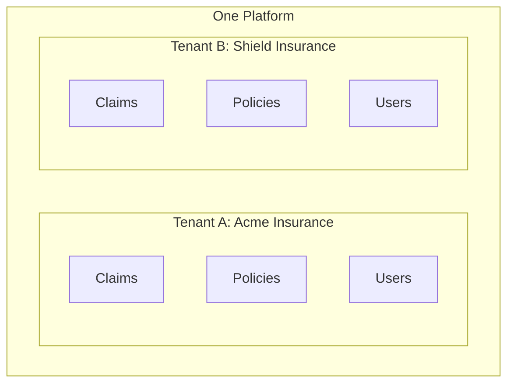
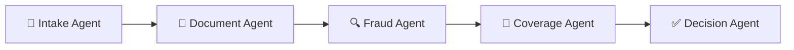

# AegisClaims AI - Interview Preparation Guide

A comprehensive guide to understanding and discussing the AegisClaims AI platform, written for anyone regardless of their background in insurance or cloud technologies.

---

## Table of Contents

1. [Executive Summary](#1-executive-summary)
2. [Insurance Domain Concepts](#2-insurance-domain-concepts)
3. [Technical Stack Explanations](#3-technical-stack-explanations)
4. [Architecture Overview](#4-architecture-overview)
5. [Key Features](#5-key-features)
6. [Project Structure](#6-project-structure)
7. [Interview Talking Points](#7-interview-talking-points)

---

## 1. Executive Summary

### What is AegisClaims AI?

**One-sentence answer**: AegisClaims AI is a software platform that uses artificial intelligence to automatically process insurance claims, deciding whether to approve, deny, or escalate them to a human reviewer.

### The Problem We Solve

Imagine you're in a car accident. You file a claim with your insurance company. Traditionally, a human adjuster would:
1. Review your claim paperwork
2. Check your policy to see what's covered
3. Look for signs of fraud
4. Make a decision (approve, deny, or request more info)

This process typically takes **days to weeks** and costs insurance companies significant money in labor.

### Our Solution

AegisClaims AI automates this entire process in **under 2 seconds**:
- AI reads and understands your claim documents
- Machine learning detects potential fraud
- An AI reasoning engine checks policy coverage
- Automatic decisions are made for clear-cut cases
- Uncertain cases are sent to human reviewers

### Why It Matters

| Metric | Before | After |
|--------|--------|-------|
| Processing Time | 3-7 days | Under 2 seconds |
| Automation Rate | ~20% | 92%+ |
| Cost per Claim | $50-100 | ~$5 |
| Fraud Detection | Reactive | Proactive |

### Who Uses It?

This is a **B2B (Business-to-Business) SaaS** product. Our customers are insurance companies, not individual consumers. Multiple insurance companies can use our platform simultaneously—each with their own isolated data and custom configurations.

---

## 2. Insurance Domain Concepts

### What is a Claim?

**Simple explanation**: A claim is a formal request you submit to your insurance company asking them to pay for something covered by your policy.

**Real-world example**: 
> You have car insurance. A tree falls on your car during a storm. You file a claim saying "A tree damaged my car. Here are photos and the repair estimate. Please pay for the repairs."

**In our system**: A claim is a data record containing:
- Who is filing (policy holder)
- What happened (incident description)
- When it happened (incident date)
- How much money is requested (claim amount)
- Supporting documents (photos, invoices, police reports)

---

### What is a Policy?

**Simple explanation**: A policy is the contract between you and the insurance company. It spells out exactly what they will and won't pay for.

**Real-world example**:
> Your car insurance policy might say: "We cover collision damage up to $50,000 with a $500 deductible. Flood damage is not covered."

**Key policy components**:
| Term | Meaning |
|------|---------|
| **Coverage** | What events/damages are protected |
| **Limit** | Maximum amount they'll pay |
| **Deductible** | Amount you pay first before insurance kicks in |
| **Exclusions** | Things specifically NOT covered |

---

### What is Claims Triage?

**Simple explanation**: Triage means sorting and prioritizing claims to decide what action to take.

**Analogy**: Think of a hospital emergency room. When patients arrive, a nurse quickly evaluates each person to decide:
- Who needs immediate attention (critical)
- Who can wait a bit (moderate)
- Who should see a regular doctor later (minor)

**In insurance claims**:
- **Auto-approve**: Clear-cut valid claims
- **Auto-deny**: Claims for things not covered
- **Escalate**: Complex cases needing human review

---

### What is a Deductible?

**Simple explanation**: The amount you pay out of pocket before insurance pays anything.

**Example**:
> Your policy has a $500 deductible. You file a claim for $2,000 in damages.
> - You pay: $500
> - Insurance pays: $1,500

**Why it exists**: Deductibles prevent people from filing tiny claims and keep premiums lower.

---

### What are Coverage Limits?

**Simple explanation**: The maximum amount an insurance company will pay for a covered claim.

**Example**:
> Your policy has a $50,000 limit for collision damage. Your car worth $80,000 is totaled.
> - Insurance pays: $50,000 (the limit)
> - You absorb: $30,000 loss

---

### What is Fraud Detection?

**Simple explanation**: Identifying fake, exaggerated, or suspicious claims.

**Common fraud patterns**:
| Type | Example |
|------|---------|
| Staged accidents | Faking a car crash for money |
| Inflated claims | Minor damage claimed as major |
| Timing fraud | Damage happened before policy started |
| Phantom claims | Claiming items that don't exist |

**How we detect it**: Our machine learning model analyzes patterns like:
- Claim amount vs policy history
- Time since policy purchase
- Document consistency
- Historical claim frequency

---

### What is Claims Automation?

**Simple explanation**: Using software and AI to handle claims without human involvement.

**The spectrum**:
```
FULLY MANUAL ◄──────────────────────────────────► FULLY AUTOMATED
     │                                                    │
Traditional                                         AegisClaims AI
(Human reviews                                    (AI handles 92%
 every claim)                                      automatically)
```

**Human-in-the-loop (HITL)**: Even with automation, some claims need human judgment. Our system automatically identifies these and routes them to human reviewers.

---

## 3. Technical Stack Explanations

### AWS Bedrock (AI/LLM Service)

**What it is in simple terms**: 
A service from Amazon that lets us use powerful AI language models (like ChatGPT, but from Anthropic called Claude) without building our own AI from scratch.

**Analogy**: Instead of manufacturing your own car engine, you buy one from a specialized company that makes world-class engines.

**Why we chose it**:
- Access to state-of-the-art AI models (Claude 3)
- No need to train or host our own models
- Enterprise-grade security and reliability
- Pay only for what we use

**How we use it**:
- **Coverage Reasoning Agent**: Sends policy details and claim info to Claude, asks "Is this claim covered? Explain your reasoning."
- **Document Understanding**: Claude can read PDFs and images to extract information

---

### AWS SageMaker (Machine Learning)

**What it is in simple terms**:
A platform for building, training, and running custom machine learning models.

**Analogy**: If Bedrock is buying a pre-made engine, SageMaker is a factory where you build your own specialized engine.

**Why we chose it**:
- We needed a custom fraud detection model trained on insurance data
- Handles model training, versioning, and deployment
- Scales automatically based on demand

**How we use it**:
- **Fraud Detection Agent**: Our custom XGBoost model runs on SageMaker
- Input: Claim details → Output: Fraud probability score (0-100%)

---

### Amazon S3 (Storage)

**What it is in simple terms**:
Cloud storage for files—like a giant, unlimited hard drive in the cloud.

**Analogy**: Google Drive or Dropbox, but designed for applications rather than humans.

**Why we chose it**:
- Unlimited storage capacity
- 99.999999999% durability (your files won't be lost)
- Cost-effective for large files
- Integrates seamlessly with other AWS services

**How we use it**:
- Storing claim documents (PDFs, photos, invoices)
- Organizing files by tenant: `tenant-acme/claims/CLM-123/invoice.pdf`

---

### DynamoDB (NoSQL Database)

**What it is in simple terms**:
A fast, flexible database that doesn't require predefined structure (unlike traditional spreadsheet-like databases).

**Analogy**: Filing cabinet with unlimited folders where you can put any type of document without a fixed form.

**Why we chose it**:
- Extremely fast (single-digit millisecond response)
- Scales automatically
- Perfect for simple key-value data
- Serverless—no servers to manage

**How we use it**:
- **Agent state**: Tracking where each claim is in the processing pipeline
- **Idempotency**: Preventing duplicate processing if a request is sent twice

---

### PostgreSQL (Relational Database)

**What it is in simple terms**:
A traditional database that stores data in tables with rows and columns, like an advanced Excel spreadsheet.

**Analogy**: A structured filing system where every form has the same fields and you can easily cross-reference data.

**Why we chose it**:
- Strong data guarantees (ACID transactions)
- Complex queries across related data
- Industry standard with mature tooling
- Perfect for business-critical data

**How we use it**:
- Storing claims, policies, decisions, users
- Running complex queries: "Show me all approved claims for Tenant X in December"

---

### OpenSearch (Vector Database)

**What it is in simple terms**:
A search engine that can find similar items based on meaning, not just exact text matches.

**Analogy**: Imagine searching for "vehicle accident" and finding documents about "car crash," "automobile collision," and "traffic incident"—even if they don't contain your exact words.

**Why we chose it**:
- Powers our RAG (Retrieval-Augmented Generation) system
- Fast similarity searches
- Managed service with automatic scaling

**How we use it**:
- **Coverage Reasoning**: Before asking AI about a claim, we find similar past claims to provide context
- Stores "embeddings" (numerical representations of text meaning)

---

### Redshift (Analytics)

**What it is in simple terms**:
A data warehouse designed for running complex analytical queries across massive datasets.

**Analogy**: If PostgreSQL is for day-to-day operations (recording each sale), Redshift is for answering big questions (What were total sales by region last year?).

**Why we chose it**:
- Handles billions of records efficiently
- Perfect for SaaS metrics and reporting
- Columnar storage optimized for analytics

**How we use it**:
- **AI Ops Dashboard**: "What's our automation rate this month?"
- **Tenant Reports**: "How many claims did each customer process?"

---

### AWS Cognito (Authentication)

**What it is in simple terms**:
A service that handles user login, registration, and access control so we don't have to build it ourselves.

**Analogy**: Like hiring a security company to manage building access instead of building your own security system.

**Why we chose it**:
- Industry-standard OAuth2/OIDC protocols
- Built-in MFA (multi-factor authentication)
- User groups for role-based access
- Integrates with AWS services

**How we use it**:
- Login flow for the dashboard
- Four role groups: Tenant Admin, Claims Adjuster, Supervisor, AI Ops
- Each user belongs to a specific tenant

---

### FastAPI (Backend Framework)

**What it is in simple terms**:
A modern Python framework for building web APIs (the backend services that power applications).

**Analogy**: If you're building a restaurant, FastAPI is the kitchen equipment—it helps you prepare and serve food (data) efficiently.

**Why we chose it**:
- Extremely fast (one of the fastest Python frameworks)
- Automatic API documentation
- Built-in data validation
- Async support for handling many requests

**How we use it**:
- All backend endpoints (`/api/v1/claims`, `/api/v1/policies`)
- Request validation (ensuring data is correct before processing)
- Middleware (audit logging, tenant extraction)

---

### React + TypeScript (Frontend)

**What it is in simple terms**:
- **React**: A JavaScript library for building user interfaces
- **TypeScript**: JavaScript with type checking (catches errors before running)

**Analogy**: React is like LEGO—you build complex UIs from small, reusable pieces. TypeScript is a spell-checker that catches mistakes as you write.

**Why we chose it**:
- Industry standard for enterprise applications
- Component-based architecture (reusable UI pieces)
- TypeScript prevents many bugs at compile time
- Rich ecosystem of libraries

**How we use it**:
- Claims dashboard
- Claim detail view (showing AI reasoning)
- AI Ops monitoring dashboard
- Login and tenant selection

---

### AWS CDK (Infrastructure as Code)

**What it is in simple terms**:
A framework that lets you define cloud infrastructure using Python code, then automatically creates those resources.

**Analogy**: Instead of clicking through AWS console to set up servers, databases, etc., you write Python code that can be executed to create everything automatically.

**Why we chose it**:
- Type-safe infrastructure with Python
- Reproducible infrastructure (same setup every time)
- Version controlled (track changes like code)
- Multi-environment (dev, staging, prod from same constructs)
- Reusable constructs for common patterns

**How we use it**:
- Define all AWS resources (VPC, databases, Cognito, etc.)
- Separate configurations for dev/staging/prod
- Easy teardown and recreation with `cdk destroy`

---

## 4. Architecture Overview

### Clean Architecture Pattern

**What it is in simple terms**:
A way of organizing code so that business logic is separated from technical details (databases, web frameworks, etc.).

**Why it matters**:

Imagine a pizza restaurant:
- **The Recipe (Domain)**: How to make a perfect pizza—this never changes
- **The Kitchen (Application)**: How orders are processed—could work in any building
- **The Building (Infrastructure)**: Specific ovens, refrigerators—can be swapped out
- **The Counter (Interface)**: How customers order—in-person, phone, app

If you want to switch from a gas oven to electric, you shouldn't need to change your recipes.

**Our layers**:

```
┌─────────────────────────────────────────┐
│ INTERFACE: FastAPI routes, React UI    │ ← How users interact
├─────────────────────────────────────────┤
│ INFRASTRUCTURE: AWS, databases         │ ← Technical implementations
├─────────────────────────────────────────┤
│ APPLICATION: Use cases, agents         │ ← Business workflows
├─────────────────────────────────────────┤
│ DOMAIN: Entities, rules                │ ← Pure business logic
└─────────────────────────────────────────┘
```

**The Rule**: Inner layers know nothing about outer layers. Domain doesn't know about AWS.

---

### Multi-Tenancy (B2B SaaS)

**What it is in simple terms**:
Multiple customers (insurance companies) share one platform while keeping their data completely separate.

**Analogy**: An apartment building—many families live there, sharing the building's infrastructure (plumbing, electricity), but each has their own private apartment that others can't access.

**How we implement it**:



- Every database record has a `tenant_id`
- Every API request requires `X-Tenant-ID` header
- S3 files organized: `{tenant_id}/documents/...`
- Users can only see their tenant's data

---

### The Five AI Agents



| Agent | What It Does | Analogy |
|-------|--------------|---------|
| **Intake** | Validates claim data, checks required fields | Receptionist checking your forms are complete |
| **Document** | Reads PDFs/images, extracts key info | Admin typing handwritten forms into computer |
| **Fraud** | Scores likelihood of fraud (0-100%) | Detective looking for suspicious patterns |
| **Coverage** | Determines if claim is covered under policy | Lawyer interpreting the contract |
| **Decision** | Makes final call: approve/deny/escalate | Manager making the final decision |

---

### Data Flow

**Step-by-step claim journey**:

```
1. Customer files claim via web/app
         ↓
2. Claim data hits our API
         ↓
3. Intake Agent validates data
         ↓
4. Documents uploaded to S3
         ↓
5. Document Agent extracts information
         ↓
6. Fraud Agent calculates risk score
         ↓
7. Coverage Agent reasons about policy
         ↓
8. Decision Agent applies rules:
   - High confidence + Low fraud → AUTO-APPROVE
   - Clear exclusion → AUTO-DENY
   - Uncertain → SEND TO HUMAN
         ↓
9. Result stored in database
         ↓
10. Customer/adjuster notified
```

---

### RAG (Retrieval-Augmented Generation)

**What it is in simple terms**:
Before asking AI a question, we first find relevant information to include in the question. This makes AI answers more accurate and grounded.

**Analogy**: 
- **Without RAG**: Asking a friend a history question from memory
- **With RAG**: Giving them the textbook chapter first, then asking

**How we use it**:

```
1. New claim comes in: "Front fender damage from parking lot incident"
         ↓
2. Convert claim text to embedding (numerical representation)
         ↓
3. Search OpenSearch for similar past claims
         ↓
4. Find: "Similar claim approved 6 months ago for same policy type"
         ↓
5. Include this context when asking Claude about coverage
         ↓
6. AI makes more informed, consistent decision
```

---

## 5. Key Features

### Automated Claims Processing

**What it does**: Handles claims from submission to decision without human intervention (when appropriate).

**Business value**:
- 92%+ automation rate
- Sub-2-second processing time
- Consistent decisions (no human bias or fatigue)
- 24/7 availability

### Document Understanding (OCR + AI)

**What it does**: Reads and extracts information from uploaded documents.

**Example**:
- Input: Scanned repair invoice PDF
- Output: `{ "vendor": "AutoFix Shop", "amount": 2450.00, "damage_type": "Collision" }`

### Fraud Detection

**What it does**: Assigns a fraud probability score to every claim.

**Signals used**:
- Claim amount relative to policy history
- Time since policy inception
- Claim description analysis
- Document metadata consistency
- Historical patterns

### Coverage Reasoning

**What it does**: AI reads the policy and claim, then explains its coverage determination.

**Output example**:
> "This claim is COVERED. The policy includes comprehensive coverage for collision damage. The claimed amount ($2,450) is within the limit ($50,000). The deductible ($500) applies. Recommendation: Approve for $1,950."

### Human-in-the-Loop (HITL)

**What it does**: Automatically identifies claims that need human review.

**Triggers for escalation**:
- AI confidence below 80%
- Fraud score above 50%
- Claim amount exceeds threshold
- Policy terms are ambiguous

### Analytics and Reporting

**What it does**: Provides insights for business and AI operations teams.

**Dashboards**:
- Automation rate trends
- Average processing time
- Model performance metrics
- Fraud detection accuracy
- Per-tenant usage statistics

---

## 6. Project Structure

### Overview

```
aegis-claims-ai-platform/
├── backend/           ← Python API (FastAPI)
├── frontend/          ← React dashboard
├── cdk/               ← Infrastructure code (AWS CDK Python)
├── prompts/           ← AI prompt templates
├── evaluations/       ← Test datasets for AI
└── docs/              ← Documentation
```

### Backend Structure (Clean Architecture)

```
backend/
├── domain/            ← CORE: Pure business logic
│   ├── entities.py    (Claim, Policy, Decision classes)
│   ├── value_objects.py (Money, Status enums)
│   └── services.py    (Business rules)
│
├── application/       ← USE CASES: Workflows
│   ├── use_cases.py   (ProcessClaim, etc.)
│   ├── agents.py      (All 5 AI agents)
│   ├── ports.py       (Interfaces for external services)
│   └── tenant_context.py
│
├── infrastructure/    ← ADAPTERS: Technical implementations
│   ├── bedrock_llm.py
│   ├── sagemaker_fraud.py
│   ├── postgres_repo.py
│   ├── dynamodb_repo.py
│   ├── s3_storage.py
│   └── opensearch_adapter.py
│
├── interfaces/        ← API: External-facing
│   ├── api.py         (FastAPI routes)
│   ├── dtos.py        (Request/response models)
│   └── middleware.py  (Logging, auth)
│
└── tests/             ← Unit and integration tests
```

**Why this organization matters**:
- Domain layer has ZERO dependencies—pure business logic
- Easy to swap infrastructure (e.g., PostgreSQL → MySQL)
- Clear separation makes testing easier
- New developers understand boundaries quickly

### Frontend Structure

```
frontend/src/
├── components/        ← Reusable UI pieces (buttons, cards)
├── pages/             ← Full page views (Dashboard, ClaimDetail)
├── services/          ← API communication layer
├── context/           ← React state management (Auth)
├── auth/              ← Route protection
└── styles/            ← CSS
```

### CDK Structure

```
cdk/
├── constructs/        ← Reusable infrastructure components
│   ├── vpc.py         (Networking)
│   ├── rds.py         (Database)
│   ├── cognito.py     (Auth)
│   ├── s3.py          (Storage)
│   ├── dynamodb.py    (NoSQL)
│   └── ai_ml.py       (Bedrock, SageMaker)
│
├── stacks/            ← Infrastructure stacks
│   └── aegis_stack.py
│
└── config/            ← Environment-specific configs
    └── environments.py (dev, staging, prod)
```

---

## 7. Interview Talking Points

### Technical Challenges Solved

**Challenge 1: Multi-tenant data isolation**
> "We needed to ensure that one insurance company could never accidentally see another's data. We solved this with tenant_id in every database record, mandatory header validation, and S3 path prefixes. Every query is automatically filtered by tenant."

**Challenge 2: Explainable AI decisions**
> "Insurance decisions can't be black boxes—regulators require explanations. We capture the full reasoning trace from our LLM, including what factors it considered and why. Every decision includes a human-readable justification."

**Challenge 3: Balancing automation with accuracy**
> "Not every claim should be auto-decided. We implemented confidence thresholds that route uncertain cases to humans. The threshold is configurable per tenant based on their risk tolerance."

### Design Decisions and Trade-offs

**Decision: Clean Architecture**
> "We chose Clean Architecture to keep our domain logic pure and testable. The trade-off is more boilerplate code, but we gain the ability to easily swap out infrastructure components without touching business logic."

**Decision: Multiple specialized databases**
> "PostgreSQL for transactional data, DynamoDB for state, OpenSearch for vectors, Redshift for analytics. The alternative was one database for everything, but each technology excels at its specific use case. The trade-off is operational complexity."

**Decision: LLM via Bedrock vs. self-hosted**
> "We chose AWS Bedrock over self-hosting for faster time-to-market and enterprise SLAs. Trade-off is less control over the model and per-token costs, but we avoid the complexity of ML infrastructure."

### Scalability Considerations

> "The system is designed to scale horizontally. FastAPI services run on ECS Fargate with auto-scaling. DynamoDB and Bedrock scale automatically. The only potential bottleneck is PostgreSQL, which we address with read replicas for heavy query loads."

### Security Considerations

> "Security is multi-layered: WAF at the edge, TLS everywhere, Cognito for authentication with MFA, RBAC with four distinct roles, tenant isolation at every layer, encryption at rest for all data stores, and comprehensive audit logging."

### Business Value Delivered

> "The platform reduces claim processing time from days to seconds, automates 92%+ of decisions, and dramatically reduces operational costs. For insurance companies, faster claims means happier customers and lower expenses."

### Questions to Expect and Prepare For

1. **"Why not just use one database?"**
   - Each database type is optimized for specific access patterns
   
2. **"How do you ensure AI decisions are reliable?"**
   - Confidence thresholds, human-in-the-loop, reasoning traces
   
3. **"What happens if AWS goes down?"**
   - Multi-AZ deployment, health checks, circuit breakers
   
4. **"How do you version AI prompts?"**
   - Prompts stored as versioned files, each tenant can pin versions
   
5. **"How do you test the AI agents?"**
   - Unit tests with mocked services, evaluation datasets, A/B testing

---

## Quick Reference Card

**Elevator Pitch (30 seconds)**:
> "AegisClaims AI is a B2B SaaS platform that automates insurance claims processing using AI. It reads claim documents, detects fraud, checks policy coverage, and makes decisions—all in under 2 seconds. 92% of claims are handled automatically, with uncertain cases routed to human reviewers. Built on AWS with Clean Architecture, it serves multiple insurance companies with complete data isolation."

**Key Numbers to Remember**:
- Under 2 seconds processing time
- 92%+ automation rate
- 5 specialized AI agents
- 4 database technologies
- $5 vs $50-100 cost per claim
- 99.9% availability target

**Technologies to Name-Drop**:
- AWS Bedrock (Claude 3 LLM)
- AWS SageMaker (ML)
- PostgreSQL + DynamoDB + OpenSearch + Redshift
- FastAPI + React + TypeScript
- AWS CDK (Python)
- Clean Architecture / SOLID principles

---

*Good luck with your interview! Remember: explain concepts simply, be honest about trade-offs, and relate technical decisions to business value.*
